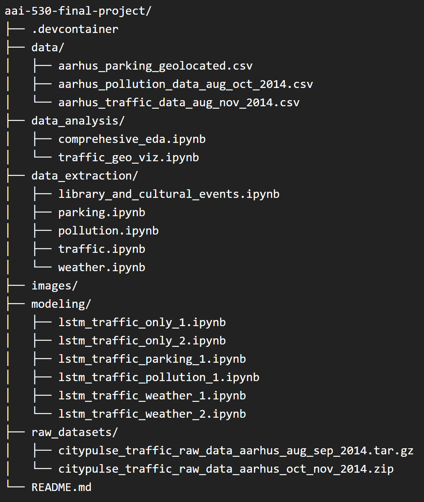

# USD - AAI 530 Final Project - Group 7 
Shiley-Marcos School of Engineering, University of San Diego AAI-500: Probability and Statistics

Group members
- Shaun Friedman
- Victoria Dorn
- Victor Hugo Germano

Files
- [Google Drive Folder with documents and colaboration files](https://drive.google.com/drive/u/1/folders/1Ho0cbkQrALTQ1QajB23yyNN9-QqUVm4Z)
- [Tableau Project Dashboard](https://public.tableau.com/app/profile/shaun.friedman2479/viz/SmartTrafficGrid/Dashboard1)

## Introduction

This project aims to leverage time series sensor data to better understand the interplay between environmental and infrastructural factors influencing traffic and air quality in Aarhus, Denmark. By combining datasets from road traffic, weather, parking, and city events, we aim to build predictive models that assist urban planners, city administrators, and the public in making data-driven decisions on transportation and environmental management. 

This repository utilizes a Docker-based environment, called a Development Container, designed to provide a consistent and reproducible setup work. Using development containers ensures that all dependencies and configurations are standardized, making it easier to collaborate across different environments and systems. We also utilize Jupyter Notebooks for their flexibility and ease of use. They allow us to run code in chunks, display rich outputs like graphs and visualizations, and combine code with markdown documentation for clear explanations. 

## Prerequisites
1. Docker: Install Docker on your machine. Follow the instructions here to get Docker installed.
2. Visual Studio Code or your preferred code editor.
3. Remote - Containers Extension: Install the "Remote - Containers" extension for VS Code from the Extensions Marketplace.

## Quick Start Guide

1. Begin by cloning the repository that contains the development container configuration:

```
git clone https://github.com/victorhg/aai-530-final-project.git
cd aai-530-final-project
```

2. Open the Project in VS Code. `code .`
3. Rebuild and Open the Container. Use the Command Palette (Ctrl+Shift+P or Cmd+Shift+P on macOS) to select Remote-Containers: Rebuild Container. VS Code will build the Docker image based on the configuration in the .devcontainer directory and open the project inside the container.
4. Once inside the development container, you can use juputer notebooks (without an exposed port). **NOTE: Included in the raw_datasets folder is the traffic datasets, otherwise data is pulled directly from the [University of Surrey server](http://iot.ee.surrey.ac.uk:8080/datasets/).**

## Repository Structure



## Additional Repository Features

#### Eporting a Jupyter Notebook as PDF. 

You can add a `--output` flag if you want to specify the output file name otherwise it will use the file_name of your .ipynb.
```
jupyter nbconvert --to pdf <file_name.ipynb>
```

## Data Rights

The datasets used are licensed under a [Creative Commons Attribution 4.0 International License](https://creativecommons.org/licenses/by/4.0/).

## References

- [CityPulse project in Aarhus, Denmark](http://iot.ee.surrey.ac.uk:8080/index.html)
- [USD Final Project Reference Document](https://sandiego.instructure.com/courses/17674/pages/review-final-team-project-description?module_item_id=663812)
